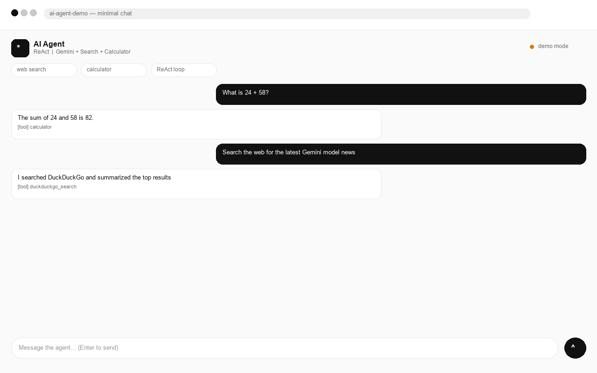
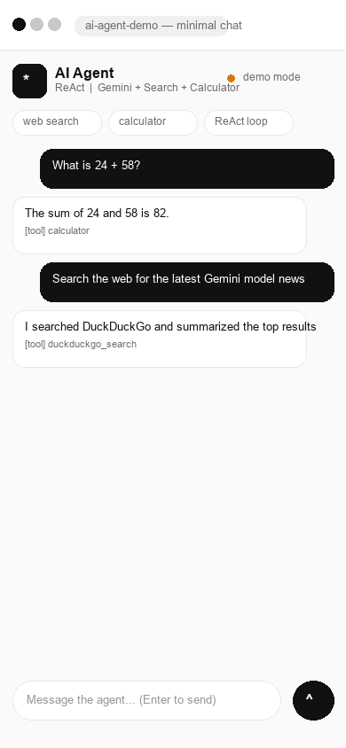
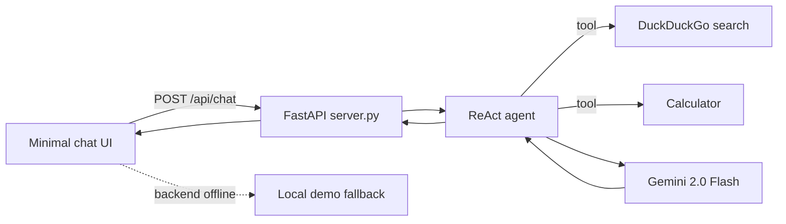

# AI-AGENTS-PYTHON — ReAct AI Agent + Minimal Chat Frontend

A Python ReAct agent (Gemini + DuckDuckGo search + calculator) with a clean,
minimal chat UI and a FastAPI backend. Open the frontend for an instant demo —
no API key needed. Connect the backend for live search + LLM answers.



> Live demo (frontend-only): enable GitHub Pages (docs below) →
> `https://ZIZ12007.github.io/AI-AGENTS-PYTHON/`

## What it does

- Chat UI sends a message to `POST /api/chat`
- Backend runs a LangGraph ReAct loop: Thought → tool → Observation → answer
- Tools: `duckduckgo_search` (live web), `calculator` (local arithmetic)
- UI shows which tools fired per reply; falls back to demo mode if backend is offline

## Repo map

```text
Project1/
  MAIN.PY              # original CLI ReAct agent
  server.py            # FastAPI wrapper (POST /api/chat, GET /api/health, serves frontend)
  requirements.txt     # backend deps
  frontend/
    index.html / styles.css / app.js   # minimal chat (demo fallback built in)
docs/
  screenshots/desktop.png / mobile.png
  PORTFOLIO.md         # copy-paste portfolio write-up
  LOOM-SCRIPT.md       # 60-second demo script
```

## Run it

Frontend only (instant):

```bash
# just open in a browser
Project1/frontend/index.html
```

Full stack:

```bash
cd Project1
pip install -r requirements.txt
# .env -> GOOGLE_API_KEY=...
uvicorn server:app --port 8000
# open http://localhost:8000/
```

API:

```bash
curl -X POST http://localhost:8000/api/chat \
  -H "Content-Type: application/json" \
  -d '{"message":"What is 24 + 58?"}'
```

## Deploy a live site (pick one)

**A. Frontend demo on GitHub Pages (free, 2 min)** —
Settings → Pages → GitHub Actions, the workflow in `.github/workflows/pages.yml`
publishes `Project1/frontend`. No key needed (demo mode).

**B. Full backend on Render (free)** — `render.yaml` included:

```bash
# Render dashboard -> New -> Blueprint -> select this repo
```

Set env `GOOGLE_API_KEY`, then point the frontend ⚙ Backend URL to
`https://<your-service>.onrender.com/api/chat`.

**C. Vercel (frontend)** — `vercel.json` included:

```bash
npx vercel --prod
```

## Screenshots

| Desktop | Mobile |
|---|---|
|  |  |

## Stack

Python · LangChain · LangGraph · Gemini (`gemini-2.0-flash`) · DuckDuckGo ·
FastAPI · Vanilla JS · GitHub Pages / Render

## Architecture


